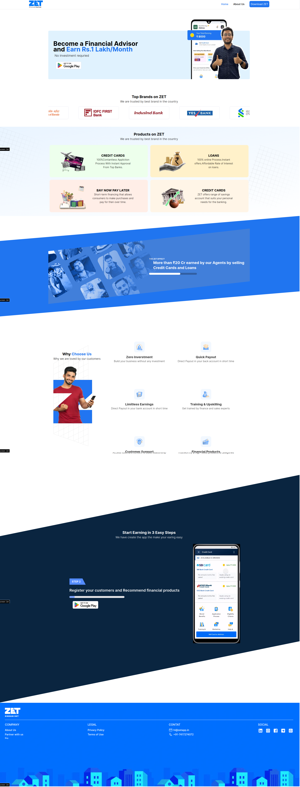

# ZetApp Banking Clone

### Domain:

Front-End Developer.

### Technologies/Tools:

HTML,TailwindCSS, JavaScript,Nextjs,TypeScript,
framer-motion,carousel,GitHub.

### Hosted url -

https://zetapp-assignment-gkb.vercel.app/

### Introduction

Introducing the ZetApp Banking Clone a cutting-edge solution that redefines the banking experience for the digital age. With meticulous attention to detail and advanced technology, our clone brings the functionalities of a modern banking system to you. Seamlessly blending convenience with security, our platform offers a comprehensive suite of banking services accessible anytime, anywhere.
Open Resume builder App put first name and other details. Click → Submit](https://zetapp-assignment-gkb.vercel.app/)

### Landing Page

Experience the next generation of banking with ZetApp Banking Clone. Our cutting-edge platform combines state-of-the-art technology with intuitive design to deliver a seamless banking experience tailored for the modern user.

#### Home

The Home page is the first page that users see when they visit the ZetApp Banking Clone. It serves as the main landing page and provides an overview of the platform's features and services. The Home page is designed to be visually appealing and user-friendly, with clear navigation and intuitive design elements.

#### About

The About page provides users with information about the ZetApp Banking Clone, including its mission, vision, and values. This page is designed to give users a better understanding of the platform and its goals, as well as the team behind it. The About page is an essential part of the platform's branding and marketing strategy.

